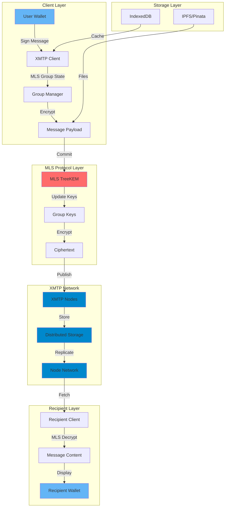
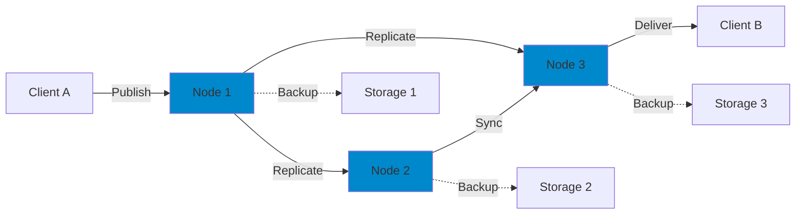
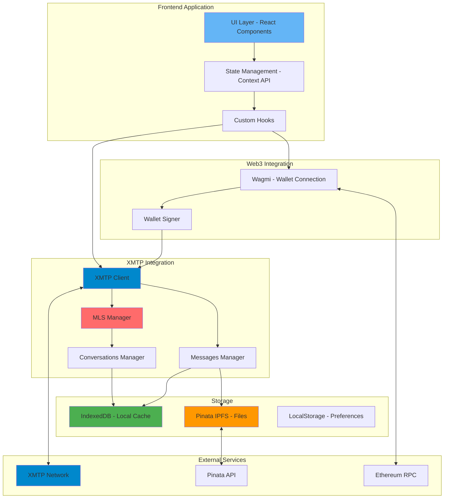
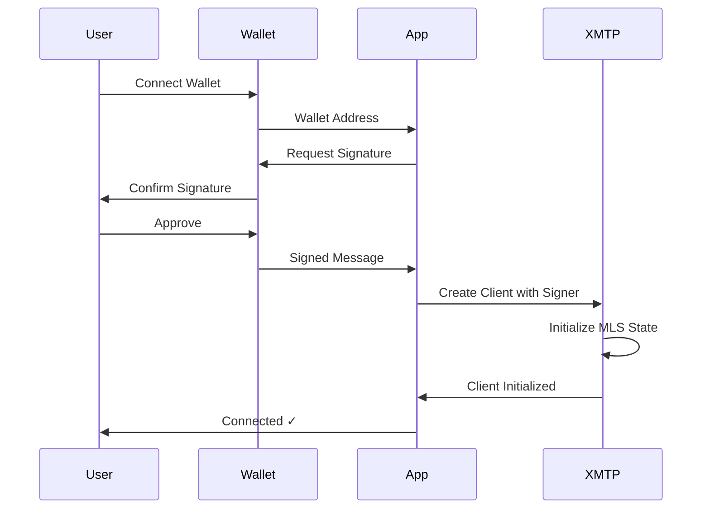
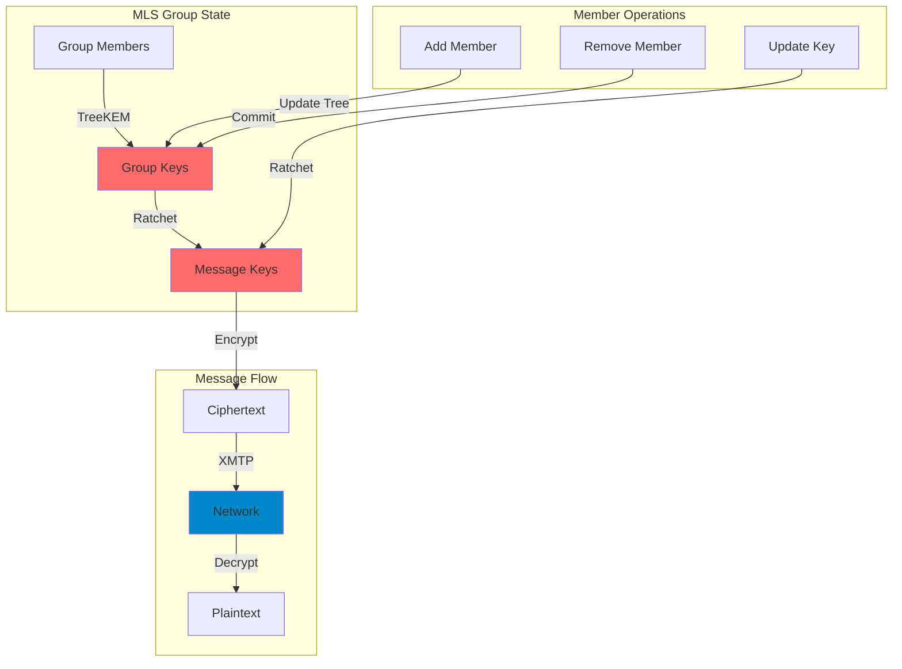
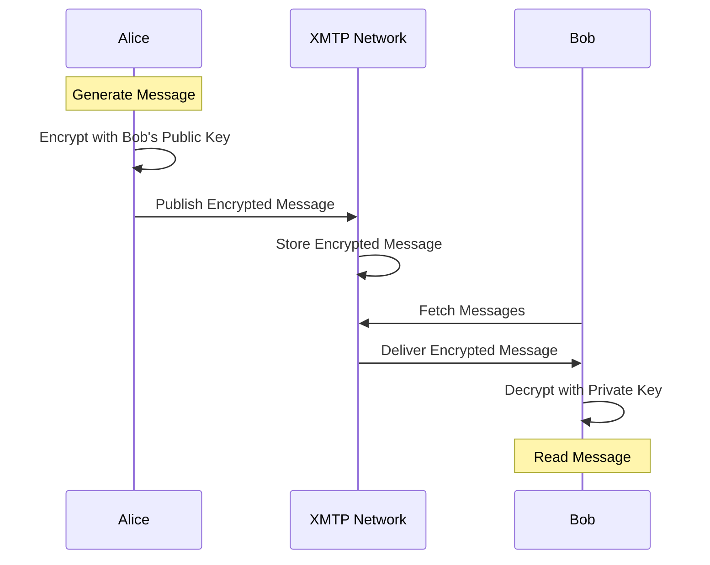
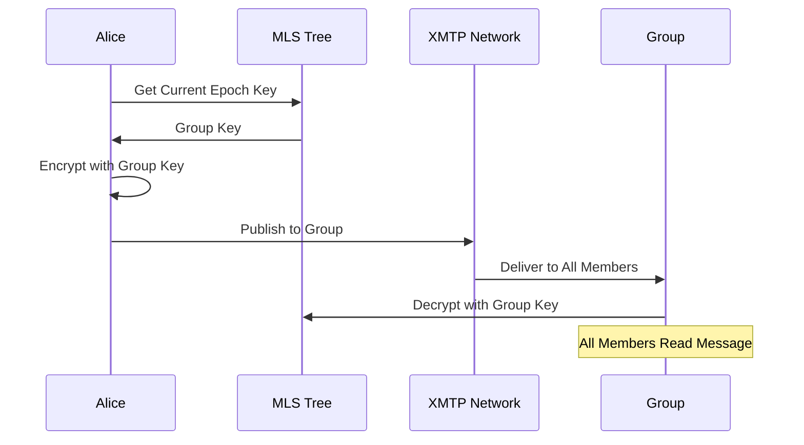

# 🚀 XMTP Telegram - Decentralized Messaging for Web3

<div align="center">


**End-to-end encrypted, decentralized messaging powered by XMTP Protocol**

[Live Demo](https://xmtp-telegram.vercel.app) • [Documentation](https://docs.xmtp.org) • [Report Bug](https://github.com/Aditya-alchemist/XMTP-Telegram/issues)

</div>

---

## 📋 Table of Contents

- [Overview](#-overview)
- [Features](#-features)
- [XMTP Architecture](#-xmtp-architecture)
- [Project Architecture](#-project-architecture)
- [Security](#-security)
- [MLS Protocol](#-mls-protocol)
- [Message Encryption](#-message-encryption)
- [Installation](#-installation)
- [Usage](#-usage)
- [Technology Stack](#-technology-stack)
- [Contributing](#-contributing)
- [License](#-license)

---

## 🌟 Overview

XMTP Telegram is a modern, decentralized messaging application built on the XMTP (Extensible Message Transport Protocol) network. It provides secure, end-to-end encrypted communication between Ethereum wallet addresses with a familiar Telegram-inspired interface.

Unlike traditional messaging apps, XMTP Telegram is:
- **Decentralized**: No central server controls your messages
- **Wallet-based**: Authentication via Ethereum wallets (MetaMask, WalletConnect)
- **MLS Encrypted**: Uses Messaging Layer Security (MLS) protocol for group chats
- **Persistent**: Messages stored in distributed XMTP network
- **File Sharing**: IPFS integration via Pinata for decentralized file storage

---

## ✨ Features

### 🔐 Security & Privacy
- ✅ End-to-end encryption using MLS (Messaging Layer Security)
- ✅ Signal Protocol for 1-on-1 conversations
- ✅ Wallet-based authentication (no emails/passwords)
- ✅ Zero-knowledge architecture
- ✅ Client-side encryption keys
- ✅ Forward secrecy for all messages
- ✅ Post-compromise security

### 💬 Messaging
- ✅ Real-time 1-on-1 conversations
- ✅ Group chats (up to 250 members) with MLS encryption
- ✅ File sharing (images, videos, documents) via IPFS
- ✅ Message read receipts
- ✅ Message persistence across devices
- ✅ Offline message delivery

### 🎨 User Interface
- ✅ Telegram-inspired dark theme
- ✅ Responsive design (mobile & desktop)
- ✅ Smooth animations with Framer Motion
- ✅ Emoji picker
- ✅ File preview and download
- ✅ Toast notifications
- ✅ Real-time updates

### 🔗 Web3 Integration
- ✅ WalletConnect & MetaMask support
- ✅ ENS name resolution
- ✅ Multi-chain support
- ✅ IPFS file storage (Pinata)

---


## 🏗️ XMTP Architecture

XMTP v3 uses MLS (Messaging Layer Security) for secure group messaging:



### XMTP Node Network



**Key Components:**
- **MLS TreeKEM**: Efficient key management for groups
- **Nodes**: Distributed servers that relay and store encrypted messages
- **Replication**: Messages replicated across multiple nodes for redundancy
- **Delivery**: Nodes ensure message delivery even if clients are offline
- **Storage**: Messages persist in the network until retrieved

***

## 🏛️ Project Architecture



***

## 🔒 Security

### Authentication Flow



### Security Features

1. **Wallet-Based Authentication**
   - No passwords or email addresses
   - Cryptographic signatures for authentication
   - Users maintain full control of private keys

2. **Zero-Knowledge Architecture**
   - Application never accesses private keys
   - All encryption/decryption happens client-side
   - Server nodes cannot read message content

3. **MLS Encryption**
   - Forward secrecy for all messages
   - Post-compromise security
   - Efficient group key management
   - Ratcheting keys prevent decryption of past messages

4. **Message Integrity**
   - Messages cryptographically signed
   - Tampering detection built-in
   - Replay attack prevention
   - Message ordering guarantees

***

## 🛡️ MLS Protocol

**Messaging Layer Security (MLS)** is an IETF standard protocol (RFC 9420) for secure group messaging:



### MLS Key Features

1. **TreeKEM Algorithm**
   - Efficient key updates for large groups
   - Only O(log n) operations for key changes
   - Maintains forward secrecy

2. **Group Operations**
   ```typescript
   // Add member to group
   await group.addMembers([newMemberAddress])
   
   // Remove member from group
   await group.removeMembers([memberAddress])
   
   // Update own keys
   await group.rotateKeys()
   ```

3. **Post-Compromise Security**
   - If a member's key is compromised, future messages remain secure
   - Automatic key rotation after each epoch
   - Self-healing properties

4. **Message Ordering**
   - Causal ordering guarantees
   - Prevents message reordering attacks
   - Consistent view across all clients

### MLS vs Traditional E2EE

| Feature | Traditional E2EE | MLS |
|---------|-----------------|-----|
| **Group Key Updates** | O(n) - All members | O(log n) - Tree structure |
| **Forward Secrecy** | Limited | Full |
| **Post-Compromise Security** | ❌ No | ✅ Yes |
| **Member Changes** | Expensive | Efficient |
| **Scale** | Small groups | Up to 250 members |

---

## 🔐 Message Encryption

### 1-on-1 Conversations (Signal Protocol)



### Group Conversations (MLS Protocol)



### Encryption Implementation

1. **Key Exchange**
   ```typescript
   // Generate identity key pair
   const identityKey = await crypto.generateKeyPair()
   
   // Generate pre-keys
   const preKeys = await crypto.generatePreKeys(100)
   
   // Publish to XMTP network
   await xmtp.publishBundle({
     identityKey: identityKey.public,
     preKeys: preKeys.map(k => k.public)
   })
   ```

2. **Message Encryption (1-on-1)**
   ```typescript
   // Fetch recipient's bundle
   const recipientBundle = await xmtp.getBundle(recipientAddress)
   
   // Establish session
   const session = await crypto.createSession(recipientBundle)
   
   // Encrypt message
   const ciphertext = await session.encrypt(messageContent)
   
   // Send via XMTP
   await conversation.send(ciphertext)
   ```

3. **Group Encryption (MLS)**
   ```typescript
   // Get group context
   const groupState = await group.getState()
   
   // Encrypt with current epoch key
   const ciphertext = await groupState.encrypt(messageContent)
   
   // Commit to group
   await group.send(ciphertext)
   ```

### Encryption Standards

- **Algorithm**: 
  - 1-on-1: X25519-ECDH + AES-256-GCM (Signal Protocol)
  - Groups: TreeKEM + AES-256-GCM (MLS)
- **Key Size**: 256-bit encryption keys
- **Forward Secrecy**: ✅ Full forward secrecy
- **Post-Compromise Security**: ✅ Yes (MLS groups)
- **Ratcheting**: Double ratchet algorithm
- **Authentication**: Ed25519 signatures

***

## 🚀 Installation

### Prerequisites

- Node.js 18+ 
- npm or yarn
- MetaMask or WalletConnect-compatible wallet
- Pinata API key (for file uploads)

### Setup

1. **Clone the repository**
   ```bash
   git clone https://github.com/Aditya-alchemist/XMTP-Telegram.git
   cd XMTP-Telegram
   ```

2. **Install dependencies**
   ```bash
   npm install --legacy-peer-deps
   ```

3. **Configure environment variables**
   ```bash
   cp .env.example .env
   ```

   Edit `.env`:
   ```env
   REACT_APP_WALLETCONNECT_PROJECT_ID=your_project_id
   REACT_APP_XMTP_ENV=production
   REACT_APP_PINATA_JWT=your_pinata_jwt
   REACT_APP_PINATA_GATEWAY=your_gateway.mypinata.cloud
   ```

4. **Start development server**
   ```bash
   npm start
   ```

5. **Build for production**
   ```bash
   npm run build
   ```

***

## 📱 Usage

### Connecting Wallet

1. Click "Connect Wallet"
2. Choose MetaMask or WalletConnect
3. Approve connection in your wallet
4. Sign message to initialize XMTP client

### Starting a Conversation

1. Click "New Chat"
2. Enter Ethereum address (0x...)
3. Optionally add contact name
4. Click "Start Chat"

### Sending Messages

- **Text**: Type and press Enter or click Send
- **Files**: Click attachment icon, select file (max 100MB)
- **Emojis**: Click smile icon to open picker

### Group Chats

1. Click "New Group"
2. Enter group name
3. Add member addresses (comma-separated)
4. Click "Create Group"

---

## 🛠️ Technology Stack

### Frontend
- **React 18** - UI library
- **TypeScript** - Type safety
- **Tailwind CSS** - Styling
- **Framer Motion** - Animations
- **Lucide React** - Icons

### Web3
- **Wagmi** - Wallet connection
- **Viem** - Ethereum interactions
- **WalletConnect** - Multi-wallet support
- **XMTP SDK v3** - Messaging protocol with MLS

### Storage
- **IndexedDB** - Local message cache
- **Pinata** - IPFS file storage
- **LocalStorage** - User preferences

### Security
- **MLS Protocol** - Group messaging security
- **Signal Protocol** - 1-on-1 encryption
- **X25519** - Key exchange
- **AES-256-GCM** - Message encryption

### Development
- **Create React App** - Build tool
- **ESLint** - Code linting
- **Prettier** - Code formatting

***

## 🤝 Contributing

Contributions are welcome! Please follow these steps:

1. Fork the repository
2. Create feature branch (`git checkout -b feature/AmazingFeature`)
3. Commit changes (`git commit -m 'Add AmazingFeature'`)
4. Push to branch (`git push origin feature/AmazingFeature`)
5. Open Pull Request

***

## 📄 License

This project is licensed under the MIT License - see the [LICENSE](LICENSE) file for details.

***

## 🙏 Acknowledgments

- [XMTP](https://xmtp.org) - Messaging protocol
- [MLS Working Group](https://messaginglayersecurity.rocks) - MLS protocol specification
- [Wagmi](https://wagmi.sh) - React hooks for Ethereum
- [Pinata](https://pinata.cloud) - IPFS infrastructure
- [Telegram](https://telegram.org) - UI/UX inspiration

***

<div align="center">

**Built with ❤️ using XMTP Protocol & MLS**

[⭐ Star this repo](https://github.com/Aditya-alchemist/XMTP-Telegram) -  [🐛 Report Issues](https://github.com/Aditya-alchemist/XMTP-Telegram/issues) -  [📖 Documentation](https://docs.xmtp.org)

</div>

***

